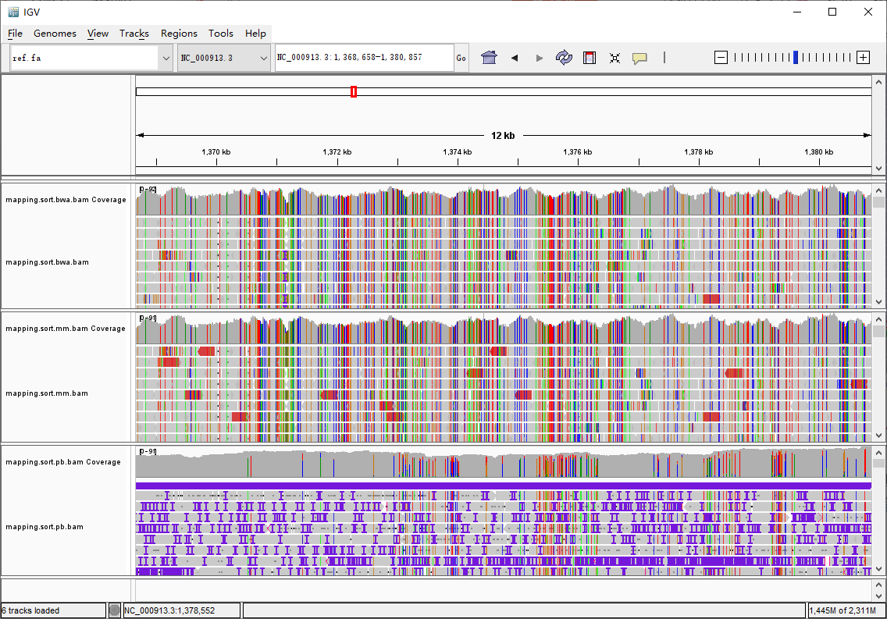

# 实验二 Mapping  
## 一、实验目的  
1. 理解比对（[mapping, alignment](https://www.eurl-ar.eu/CustomerData/Files/Folders/31-training-course-kgs-lyngby-2018/435_alignment-and-mapping-philip-clausen.pdf)）的含义  
2. 理解全局比对和局部比对的区别和应用  
3. 掌握应用bwa, minimap2, samtools的使用  
4. 理解SAM, BAM文件格式  

## 二、基因组mapping原理  
### 定义
将短的reads回帖到长的参考基因组上，这一过程称之为mapping。

### 两种策略  
1. Global alignment  
2. Local alignment  

我们熟悉的blast和blat均属于第二类。   
另外，不同长度的reads比对所用的策略也不一样，对于短reads，基于local alignment的软件如blast, blat不适合。  

### mapping要求
一般reads数目很大，读长短，参考基因组较长，对于mapping软件有两个要求：
> 速度  
> 准确性

### mapping常用软件
> 著名基因组软件：bwa, soap, bowtie, novoalign  
> 著名转录组软件：STAR, hisat  

### What makes mapping challenging?（挑战）
1. Volume of data
2. Garbage reads
3. Errors in reads, and quality scores
4. Repeat elements and multicopy sequence
5. SNPs/SNVs
6. Indels
7. Splicing (transcriptome)

### 影响mapping速度的因素
1. How many mismatches to allow?
2. Report how many matches?
3. Require best match, or first/any that fit criteria?

## 三、上机操作  
### 进入genomelab环境（可不操作）
```shell
$ source /opt/miniconda3/bin/activate
$ conda activate genomelab
```

### 3.1 创建工作目录  
```shell
$ cd YourStudentID/genomicLab
$ mkdir lab2
$ cd lab2
$ mkdir data
$ mkdir results
```

### 3.2 数据存放位置  
> /data/stdata/genomic/lab02/data/ref.fa (参考序列)  
> /data/stdata/genomic/lab02/data/reads_1.fq.gz, /data/stdata/genomic/lab02/data/reads_2.fq.gz (illumina reads)  
> /data/stdata/genomic/lab02/data/pb_ecoli_0001.fastq (pacbio reads)  

### 3.3 使用 _[bwa](https://www.jianshu.com/p/19f58a07e6f4)_ 将reads比对到参考基因组   
#### 1）准备数据 
```shell
$ cd data
$ ln -s /data/stdata/genomic/lab02/data/reads_* ./
$ ln -s /data/stdata/genomic/lab02/data/ref.fa ./
$ ln -s /data/stdata/genomic/lab02/data/pb_ecoli_0001.fastq ./
```
#### 2）获取参考基因组大小信息
```sh
$ samtools faidx ref.fa
$ mkdir index
$ cd index
$ ln -s ../ref.fa ./
```

#### 3）使用bwa对参考基因组建立索引  
work_bwaIndex.sh  
```shell
#!/bin/bash
#$ -S /bin/bash
#$ -N INDEX
#$ -j y
#$ -cwd

bwa index ref.fa
```

```shell
# 用qsub提交任务至计算节点
$ qsub work_bwaIndex.sh
```

#### 4）Mapping using _bwa_  
```shell
cd ../../results
```

work_bwa.sh  
```shell
#!/bin/bash
#$ -S /bin/bash
#$ -N bwa
#$ -j y
#$ -cwd

bwa mem ../data/index/ref.fa ../data/reads_1.fq.gz ../data/reads_2.fq.gz | \
  samtools view -b - | \
  samtools sort -o mapping.sort.bwa.bam -
samtools index mapping.sort.bwa.bam
```

```shell
# 用qsub提交任务至计算节点
$ qsub work_bwa.sh
```

### 3.4 使用 _[minimap2](https://www.jianshu.com/p/d1868194b65e)_ 将reads比对到参考基因组  

work_minimap2.sh  
```shell
#!/bin/bash
#$ -S /bin/bash
#$ -N minimap2
#$ -j y
#$ -cwd

minimap2 -ax sr ../data/ref.fa ../data/reads_1.fq.gz ../data/reads_2.fq.gz | \
 samtools view -b - | \
 samtools sort -o mapping.sort.mm.bam -
samtools index mapping.sort.mm.bam
```

```shell
# 用qsub提交任务至计算节点
$ qsub work_minimap2.sh
```

### 3.5 使用 _[minimap2](https://www.jianshu.com/p/d1868194b65e)_ 将三代测序reads比对到参考基因组  
work_minimap_pb.sh  
```shell
#!/bin/bash
#$ -S /bin/bash
#$ -N mm_map-pb
#$ -j y
#$ -cwd

minimap2 -ax map-pb ../data/ref.fa ../data/pb_ecoli_0001.fastq | \
 samtools view -b - | \
 samtools sort -o mapping.sort.pb.bam -
samtools index mapping.sort.pb.bam
```

```shell
# 用qsub提交任务至计算节点
$ qsub work_minimap_pb.sh
```

### 3.6 显示和比较比对结果  
[使用IGV](https://blog.csdn.net/qq_22253901/article/details/119845652)查看比对结果  
 

## 四、作业与思考  
1. 先组装，得到contigs (assemble short reads using SPAdes, assemble pacbio long reads using canu | mecat | miniasm)  
2. 然后将contigs用bwa mem比对到参考基因组上  
3. 用igv显示比对结果   

## 五、参考资料  
[bwa](https://bio-bwa.sourceforge.net/bwa.shtml)  
[minimap2](https://lh3.github.io/minimap2/minimap2.html)  
[samtools](http://www.htslib.org/)  
[IGV](http://software.broadinstitute.org/software/igv/)  

